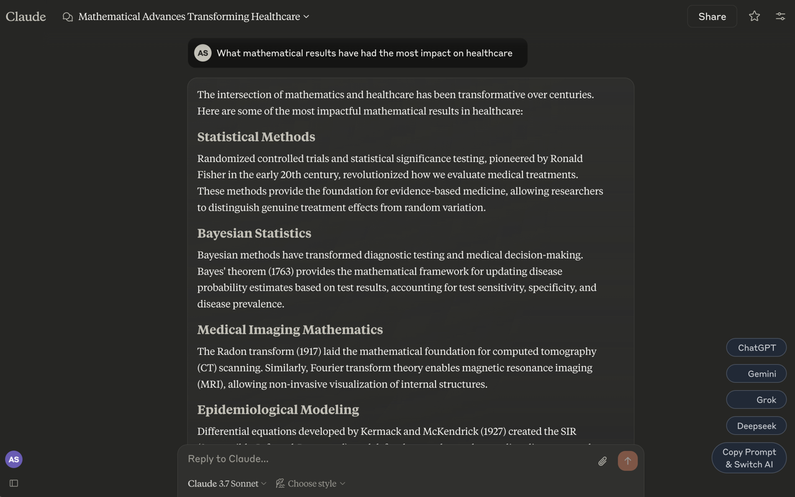
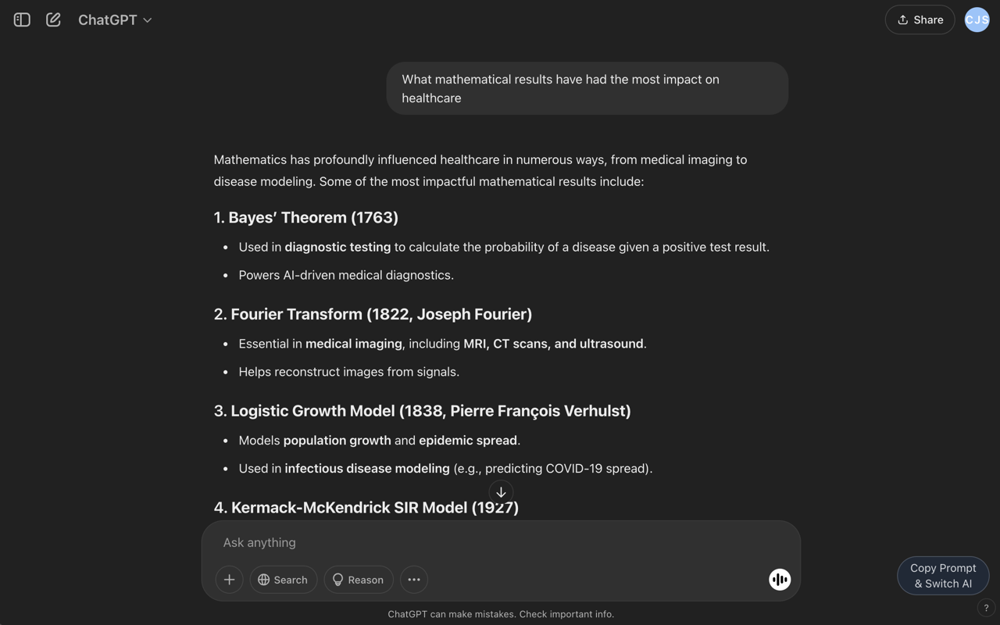
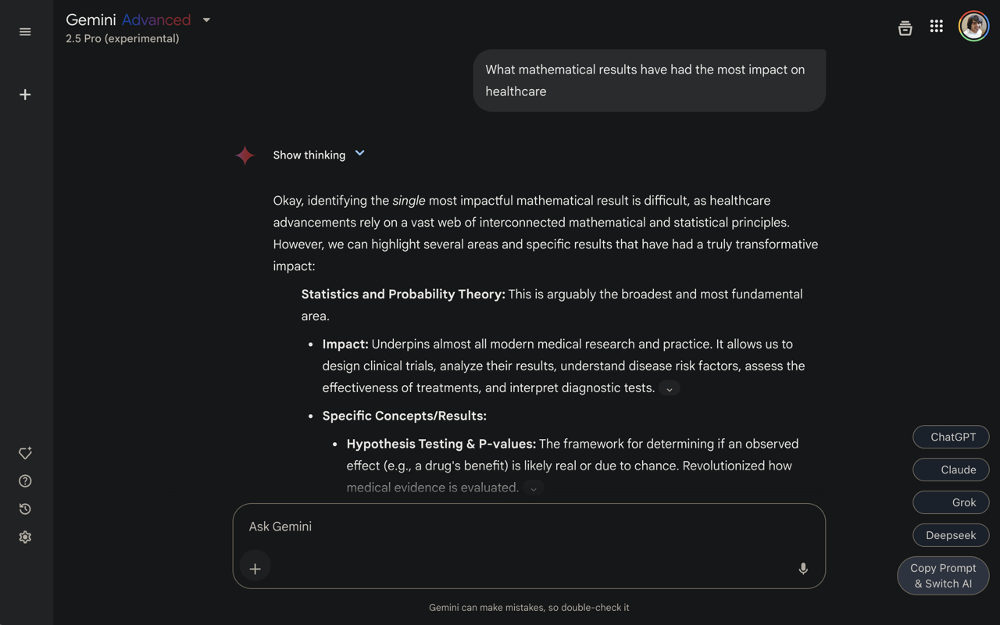

# AI Switcher

A Chrome extension that lets you replicate conversations between different AI chat applications.

## Supported AI Platforms

- ChatGPT (https://chatgpt.com/)
- Google Gemini (https://gemini.google.com/)
- Anthropic Claude (https://claude.ai/)
- xAI Grok (https://grok.com/)

## Installation

1. Open Chrome and go to `chrome://extensions/`
2. Enable "Developer mode" (toggle in the top right)
3. Click "Load unpacked" and select this folder
4. Visit any supported AI chat app and you'll see buttons for the other platforms

## Features

- Shows floating action buttons for other AI platforms when you're using one of the supported platforms
- Copies the first prompt to your clipboard when you click a button
- Opens a new tab with the selected AI platform
- Shows a toast notification when the prompt is copied
- Automatically detects which AI platform you're currently using
- Uses Tailwind CSS for styling

## How It Works

When you're using one of the supported AI chat platforms, the extension displays floating buttons for all the other AI platforms. Clicking a button will:

1. Copy the first prompt from your current conversation to your clipboard
2. Show a toast notification to confirm
3. Open a new tab with the selected AI platform
4. You can then paste the prompt into the new platform

## Screenshots





## Permissions

This extension only activates on the supported AI chat platforms.

## Development

### Creating a release package

To create a ZIP file for submission to the Chrome Web Store:

```bash
# Using the export script directly
./export.sh

# Or using npm
npm run export
```

This will create a ZIP file in the `releases` directory with the current date and timestamp.